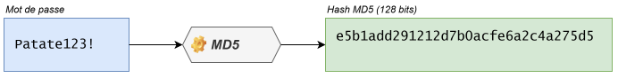
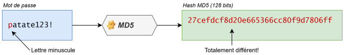
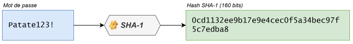
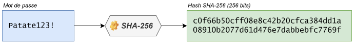
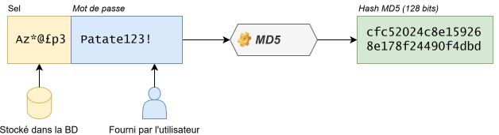

Bienvenue au cours d'introduction à la cybersécurité. Le cours se divise en 3 parties:

1. Fondements de la cybersécurité
2. Cybersécurité des réseaux et postes de travail
3. Cybersécurité applicative

On veut susciter des **discussions** de groupe. On veut des cours **dynamiques**. Soyez **participatifs**!

Vous pouvez récupérer votre plan de cours dans Léa.

:::danger Mise en garde importante
Dans ce cours, vous apprendrez des techniques de _hacking_ qui,
en dehors du cadre de ce cours, peuvent être **interdites** ou **illégales**.
Vous devez vous conformer aux lois et réglementations en vigueur et ne pas
utiliser ces compétences à des fins malveillantes ou sans autorisation préalable.

Soyez **responsables** et utilisez vos connaissances de
manière **éthique** et **légale**. La cybersécurité est un domaine
passionnant, mais il est essentiel de respecter les droits et la vie privée
des autres.
:::

## Qu'est-ce que la cybersécurité?

> **cybersécurité** _n.f._ Ensemble des moyens utilisés pour assurer la sécurité des systèmes et des données informatiques d'un État, d'une entreprise, etc. ([Source: Le Robert](https://dictionnaire.lerobert.com/definition/cybersecurite))

La **cybersécurité**, c'est la protection des **informations**, des **systèmes** et des **services informatiques** contre des menaces, par exemple:

- Le vol d'informations
- L'accès non autorisé à un ordinateur
- La perte de données (intentionnelle ou accidentelle)
- La fraude
- L'interruption non planifiée d'un service
- La destruction ou la modification de données
- L'utilisation abusive d'un système
- etc.

Elle a pour objectif de **prévenir** ou à tout le moins **réduire** au maximum la **probabilité** et l'**impact** de ces incidents.

## Menace, vulnérabilité, exploits, correctifs

La jargon de la cybersécurité.

| Termes                  | Définition                                                                            | Exemple pour une maison                                                                                                                                                                                                               | Exemple cyber                                                                         |
| ----------------------- | ------------------------------------------------------------------------------------- | ------------------------------------------------------------------------------------------------------------------------------------------------------------------------------------------------------------------------------------- | ------------------------------------------------------------------------------------- |
| Menace                  | Un événement / quelque chose / quelqu'un pouvant causer du dommage                    | Un frère qui veut emprunter ton vélo                                                                                                                                                                                                  | Un hacker                                                                             |
| Faille /  Vulnérabilité | Une faiblesse pouvant être exploitée                                                  | Un antivol à code cheapette                                                                                                                                                                                                           | Un mot de passe faible                                                                |
| Exploit                 | La série d'étapes techniques détaillées permettant d'exploiter la faille concrétement | Tirer sur l'arceau tout du long <br/> Tourner la roue la plus à gauche et s'arrêter sur le chiffre qui résiste <br/> Faire la même chose sur le chiffre 2 3 et 4 <br/> Revenir sur les roues précédentes si ça n'ouvre pas et répéter | Le hacker qui devine le mot de passe faible                                           |
| Correctif               | Une mesure pour corriger une vulnérabilité                                            | Installer un verrou sur la porte                                                                                                                                                                                                      | Utiliser un mot de passe fort                                                         |
| Risque                  | La probabilité ou le potentiel de dommage                                             | La probabilité que le cambrioleur entre et vole des objets de valeur                                                                                                                                                                  | La probabilité que le hacker devine le mot de passe et accède à des données sensibles |

Ce qu'on cherche à éviter:

- Que nos données confidentielles soient divulguées à des personnes non autorisées
- Que notre ordinateur soit contrôlé par un hacker
- Que les services desquels nous dépendons soient dégradés (par exemple, perte d'accès)
- Que nous utilisions un service malicieux en le croyant légitime
- Que nos données soient effacées ou altérées sans notre consentement

Pour ne pas que ces menaces constituent un risque réel, il faut se protéger en éliminant, ou en mitigeant, les vulnérabilités. Vous avez sans doute en tête plusieurs méthodes de protection: un **mot de passe** solide, un **antivirus**, un **pare-feu**, un **VPN**, une méthode de **chiffrement** (ou l'anglicisme _encryption_), etc. Nous les explorerons plus en détails dans les semaines qui viennent.

---

## Du hash, du crack et du sel

### Hacher des mots de passe

De nombreuses applications exigent que son utilisatrice ou utilisateur prouve son identité. Une manière d'y parvenir est de demander une information que seule cette personne connaît. Bien sûr, pour savoir si le mot de passe est le bon, il faut que l'application puisse s'assurer que le mot de passe est bon, mais si elle le connaît, alors l'utilisatrice ou l'utilisateur ne sera plus la seule personne à détenir l'information. Pour cette raison, les mots de passe ne sont jamais stockés en texte clair dans les bases de données. La plupart du temps, les applications passent le mot de passe à travers une **fonction à sens unique** qu'on appelle **algorithme de hachage**, ce qui transforme le mot de passe en une **signature numérique**, ou **_hash_**. C'est ce hash qui est stocké dans la base de données.

Plus spécifiquement, l'algorithme de hachage prend le mot de passe en entrée de **longueur varible** et lui fait passer une série d'opérations mathématiques afin de produire une chaîne de caractères (le _hash_) en sortie de **longueur fixe**. Cet algorithme est **unidirectionnel**: il est donc impossible de faire l'opération inverse (retransformer le _hash_ et mot de passe).

Consultez l'article sur [Wikipédia](https://fr.wikipedia.org/wiki/Fonction_de_hachage_cryptographique).

Il existe plusieurs algorithmes de hachage (CRC, MD5, SHA-1, SHA-2, etc.). Ces algorithmes produisent un très grand nombre, représenté le plus souvent en hexadécimal par une chaîne de caractères de longueur fixe. La longueur de la chaîne varie selon l'algorithme et est la même peu importe le nombre de caractères du mot de passe.

<div align="center"></div>

Le _hash_ est une **signature numérique**. Deux jeux de données identiques vont toujours donner le même hash pour un algorithme donné, mais une petite différence, si minime soit-elle, va donner un hash complètement différent.

<div align="center"></div>

C'est pour cette raison que le _hash_ est très intéressant pour la validation et le stockage des mots de passe. L'application n'a pas besoin de connaître le mot de passe pour le valider, elle n'a qu'à demander à l'utilisateur se hacher son mot de passe avant de le transmettre et comparer ce _hash_ à celui qui se trouve dans sa base de données. Si les _hash_ correspondent, cela prouve que le mot de passe que l'utilisateur vient d'entrer pour s'authentifier est identique à celui qu'il a entré lorsqu'il a créé son compte.

Le _hash_ n'est donc pas une version chiffrée (_encryptée_) du mot de passe et n'est utile que pour vérifier si le mot de passe est bon. Si le hash généré à la création du mot de passe est identique à celui généré à l'authentification, cela prouve que le mot de passe est bon.

Bien sûr, pour que ça fonctionne, il faut toujours utiliser le même algorithme de hachage, car chaque algorithme calcule ses hash différemment. Certains sont très faibles ou considérés comme désuets (CRC, MD5, SHA-1...) alors que d'autres sont particulièrement robustes avec peu de chances de collision (SHA-256, SHA-512...).

<div align="center"></div>

<div align="center"></div>

:::info Le hachage, bien plus que des mots de passe!
Le hachage est utile pour bien d'autres choses que les mots de passe. Toute information, comme un document, une image ou tout autre fichier, peut être passée dans un algorithme de hachage afin de produire une signature numérique permettant d'attester son intégrité. Nous y reviendrons plus tard dans la session. Pour l'instant, concentrons-nous sur les mots de passe.
:::

---

### Craquer des mots de passe

Une fonction de hachage est **unidirectionnelle** : il est impossible de faire l'opération inverse, c'est‑à‑dire convertir un hachage pour retrouver le mot de passe qui l'a généré. Pour valider un mot de passe, on demande le mot de passe à l'utilisateur, on le hache, puis on compare le hachage avec celui stocké dans la base de données. S'ils concordent, on suppose que le mot de passe est valide. Les chances qu'un autre mot de passe que le vôtre génère le même hachage, avec l'algorithme MD5, sont de $2^{128}$, soit environ 340 sextillions (340 suivi de 36 zéros).

Donc si un pirate s'introduit dans une base de données et vole les hachages de mots de passe, il ne pourra pas directement trouver les mots de passe des utilisateurs. En théorie. Parce que comme vous allez le voir, certains mots de passe sont plus faciles à craquer que d'autres!

Il y a deux manières de craquer un mot de passe, c'est-à-dire retrouver un mot de passe à partir d'un hash:

#### L'attaque par force brute

La méthode la plus intuitive consiste à simplement essayer toutes les combinaisons possibles jusqu'à en trouver une qui donne un _hash_ identique à ce qu'on cherche. On va sûrement finir par tomber sur le bon mot de passe, mais ça va être très long. Plus le mot de passe est long, plus ça risque de prendre du temps.

Pour accélérer un peu le processus, on va souvent utiliser une liste de mots de passe les plus fréquents en premier pour accélérer l'attaque. On part de l'hypothèse que `Bonjour` ou `Patate123!` ont davantage de chances d'être le mot de passe que `@?¬%+A¾{*\­_[` ou `Pinotte Rhododendron 86 Nabuchodonosor`. On appelle ce procédé une attaque par dictionnaire. Plus le mot de passe est long et complexe, moins il risque de se retrouver dans le dictionnaire de l'attaquant, et plus longue sera l'attaque.

:::tip Combien de temps pour craquer mon mot de passe?
Pour avoir un estimé du temps requis pour craquer un mot de passe, vous pouvez essayer [cet outil](https://bitwarden.com/password-strength/#Password-Strength-Testing-Tool). Par exemple:

| Mot de passe | Temps estimé de craquage |
| :-- | :-- |
| `Bonjour` | Moins d'une seconde |
| `Patate123!` | 4 heures |
| `@?¬%+A¾{*\­_[` | 31 ans |
| `Pinotte Rhododendron 86 Nabuchodonosor` | Plusieurs siècles |

:::

#### Les hash précalculés

Les attaques par force brute ont un grand défaut: elle peuvent mettre beaucoup de temps avant d'arriver à craquer le mot de passe, car les algorithmes de hachage impliquent des opérations mathématiques complexes qui exigent du temps de processeur.

Pour accélérer l'attaque, on peut créer une base de données de mots de passe potentiels et précalculer leur _hash_. Cette base de données est très longue à construire, mais une fois qu'elle l'est, on n'a plus qu'à rechercher le _hash_ pour obtenir le mot de passe qui y est associé, ce qui est beaucoup plus rapide à traiter.

Une telle base de données peut être très volumineuse et très longue à construire, en fonction de sa taille et de l'algorithme choisi. Mais plus elle est grande, plus elle connaît un grand nombre de _hash_ et plus grandes sont les chances que votre mot de passe s'y trouve.

Le site [CrackStation](https://crackstation.net/) permet d'interroger une table arc-en-ciel en ligne.

:::info Les tables arc-en-ciel
Vous avez peut-être déjà entendu parler des tables arc-en-ciel (ou en anglais, _rainbow table_). C'est une forme de dictionnaire de _hash_ précalculé qui organise les données plus efficacement en stockant des chaînes de hash plutôt que de simples correspondances. Nous n'aborderons pas les concepts mathématiques derrière la cryptographie et le calcul de _hash_ dans ce cours.
:::

---

### Et pour finir, une pincée de sel

On peut réduire le risque qu'un hachage soit craqué en lui introduisant un **sel** (_salt_). Le sel est une partie du mot de passe qui est inconnue de l'utilisateur. Lorsque l'utilisateur entre son mot de passe, l'application lui ajoute automatiquement le sel stocké dans sa base de données, puis passe les deux ensemble dans l'algorithme de hachage.

<div align="center"></div>

---

## Exercices / _Capture-the-flag_

Chaque séance, nous aurons des exercices / CTF (_Capture The Flag_) à réaliser.

1. Allez sur [ce générateur de hachage MD5](https://webutility.io/md5-hash-generator-with-salt). Il permet de générer un _hachage_ salé avec un sel de votre choix.
2. Essayez d'entrer les mots de passe précédents qui ont été craqués avec succès (un à la fois).
3. Prenez en note le hachage puis essayez de les craquer de nouveau avec [Crack Station](https://crackstation.net).

<details>
<summary>🚩 CTF-crack (2 points)</summary>

📄 **Fichier de remise**: `ctf-crack.md`

**Objectif**: Craquer les hachages MD5 fournis et trouver les mots de passe originaux.

Voici une liste de hachages MD5 interceptés. Votre mission est de retrouver les mots de passe correspondants:

```text
2dd422cb609c9f115b229babf0308723
39c0f34be508d07a9d350318010d19a4
f6d928890d38b3f5b76ff5ca7db8959c
25138b6ee073a66f529c8fcc72108ec9
0674272bac0715f803e382b5aa437e08
de81459305398c88048a05a620fb4717
5f02f0889301fd7be1ac972c11bf3e7d
b89f7a5ff3e3a225d572dac38b2a67f7
0f5264038205edfb1ac05fbb0e8c5e94
8d4d82ab28ab3287520c334545eda1eb
43d2335dd28753bff6634ccff9d6efe3
de81459305398c88048a05a620fb4717
5f02f0889301fd7be1ac972c11bf3e7d
b89f7a5ff3e3a225d572dac38b2a67f7
ba36fe9406f8806dbbcc0ab92a1b75ad
0ecee728bf87a4c1a02883004044dcd5
23b9eda5846a4017ec006a8b998cea72
25138b6ee073a66f529c8fcc72108ec9
```

**Votre mission**:

1. Utilisez [Crack Station](https://crackstation.net) ou un autre outil de craquage de hash
2. Identifiez quels mots de passe ont pu être craqués
3. Produit le flag comme suit: `CEM{mdp1-mdp2-mdp3-...}`

**Récompense**:

- Crée un compte sur https://ctf.info.cegepmontpetit.ca/ 
- Collecte tes points sur https://ctf.info.cegepmontpetit.ca/challenges#Crack%20MD5-18
- Classement : https://ctf.info.cegepmontpetit.ca/scoreboard

**À inclure dans votre rapport**:

- La liste des hachages avec leurs mots de passe correspondants (quand trouvés)
- Pourquoi certains hachages n'ont pas pu être craqués selon vous?

:::tip Réflexion

- Qu'est-ce qui rend un mot de passe facile ou difficile à craquer?
- Comment fonctionne Crack Station? (tables arc-en-ciel, dictionnaires...)
:::

</details>

<details>
<summary>🚩 CTF-hash-bits-MD5 (2 points)</summary>

📄 **Fichier dans ton repo**: `ctf-hash-bits-md5.md`

**Objectif**: les algos de hachage génèrent des hachages de longueur fixe. Le but de ce CTF est de trouver la longueur en bits d'un hash.

**Votre mission**:

1. Produire le hash MD5 de "bits bits bits hash hash hash" ce qui te donne **hash**
2. Trouver la longueur du hash en nombre de caractères ce qui te donne **lc**
3. Déduire sa longueur en bits ce qui te donne **lb**
4. La valeur du CTF sera `CEM{hash-lc-lb}`

Collecte tes points CTF :  https://ctf.info.cegepmontpetit.ca/challenges#MD5%20et%20ses%20bits-19

</details>

<details>
<summary>🚩 CTF-hash-bits-SHA256 (2 points)</summary>

📄 **Fichier dans ton repo**: `ctf-hash-bits-sha256.md`

**Objectif**: les algos de hachage génèrent des hachages de longueur fixe. Le but de ce CTF est de trouver la longueur en bits d'un hash.

**Votre mission**:

1. Produire le hash SHA256 de "bits bits bits hash hash hash" ce qui te donne **hash** (Vous pouvez utiliser cette application: [SHA hash generator](https://coddy.tech/tools/hash-generator))
:::danger
Le hash MD5 de ce générateur n'est PAS fonctionnel, continuez à utiliser l'application qu'on mentionne plus haut!
:::
2. Trouver la longueur du hash en nombre de caractères ce qui te donne **lc**
3. Déduire sa longueur en bits ce qui te donne **lb**
4. La valeur du CTF sera `CEM{hash-lc-lb}`

Collecte: https://ctf.info.cegepmontpetit.ca/challenges#SHA-256%20et%20ses%20bits-20

</details>

<details>
<summary>🚩 CTF-hash-bits-SHA512 (2 points)</summary>

📄 **Fichier dans ton repo**: `ctf-hass-bits-sha512.md`

**Objectif**: les algos de hachage génèrent des hachages de longueur fixe. Le but de ce CTF est de trouver la longueur en bits d'un hash.

**Votre mission**:

1. Produire le hash SHA512 de "bits bits bits hash hash hash" ce qui te donne le **hash**
2. Trouver la longueur du hash en nombre de caractères ce qui te donne **lc** (longueur carctères)
3. Déduire sa longueur en bits ce qui te donne **lb**
4. La valeur du CTF sera `CEM{hash-lc-lb}`

Collecte: https://ctf.info.cegepmontpetit.ca/challenges#SHA-512%20et%20ses%20bits-21

</details>

<details>
<summary>🚩 CTF-court-et-incassable (1 point)</summary>

📄 **Fichier dans ton repo**: `ctf-court-et-incassable.md`

**Objectif**: Trouver un mot de passe de 4 caractères ou moins que Crack Station n'arrive pas à craquer.

**Votre mission**:

1. Trouvez un mot de passe de **4 caractères maximum** 
2. Générez son hash MD5 
3. Vérifiez que Crack Station ne peut PAS le craquer

**Indice**: Vous pouvez partir de `()[]{}`

**Récompense bonus**:

- **3 points supplémentaires** si vous trouvez un mot de passe non craquable de **7 caractères ou moins**

**À inclure dans votre rapport**:

- Le mot de passe trouvé
- Son hash MD5 avec le [générateur de MD5](https://webutility.io/md5-hash-generator-with-salt)
- Une capture d'écran prouvant que Crack Station ne peut pas le craquer
- Votre explication de pourquoi ce mot de passe court résiste au craquage

</details>

<details>
<summary>🚩 CTF-crack (2 points)</summary>

📄 **Fichier de remise**: `ctf-sale-mais-pas-top.md`

**Objectif**: Créer un hachage MD5 salé qui sera quand même craquable par CrackStation.

**Votre mission**:

1. Utilisez le [générateur de hachage MD5 avec sel](https://webutility.io/md5-hash-generator-with-salt)
2. Trouvez une combinaison mot de passe + sel qui produit un hachage craquable par CrackStation
3. Documentez votre découverte

:::tip Indice
Réfléchissez à comment CrackStation fonctionne... Si le sel + mot de passe forme quelque chose de connu, ça pourrait marcher!
:::

**Récompense**: 1 point au tableau des scores si vous trouvez une combinaison craquable.

**À inclure dans votre rapport**:

- Le mot de passe utilisé
- Le sel utilisé
- Le hachage généré
- La preuve que CrackStation a réussi à le craquer
- Votre explication de pourquoi ça a fonctionné

</details>

---

## Présentation du TP1

Le prof va présenter le [travail pratique 1](../tp/tp1). Il se fera en équipe de 2.
